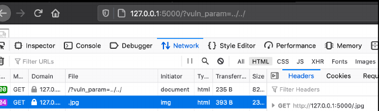
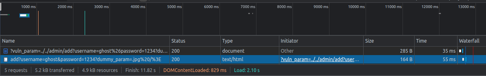

## OSRF (On Site Request Forgery)
 
 
 ```python
from flask import Flask, request, redirect

app = Flask(__name__)


@app.route("/")
def on_site_request_forgery():
    vuln_param = request.args.get("vuln_param")
    return "<html><body> '</body></html>".format(vuln_param)


@app.route("/admin/add")
def add_admin():
    user = request.args.get("username")
    passwd = request.args.get("password")
    return "Admin Added"


app.run()

 ```
 
 
 - the whole goal of this vulnerability application is to force the user to send a request to the "admin/add" endpoint. Foing so will cause the application to add an admin user which the attacker could use to login to the victims application.
 
 
 
 
 as you can see above it caused the application to send a GET request to the path "/" instead of "/images". this is because the "../" characters tell the server to go back on directory
 
 
- note when sending multiple parameters we must URL encode "&" character otherwise the browser will think it belongs to the first request not the second. also notice how the password is "1234.jpg" and not "1234". this is because ".jpg" is appended to the string at the end to get rif of these characters in our password we can just add a dummy parameter as shown below: 

 - `http://127.0.0.1:5000/?vuln_param=../../admin/add?username=ghost%26password=1234?dummy_param=`
 
 
